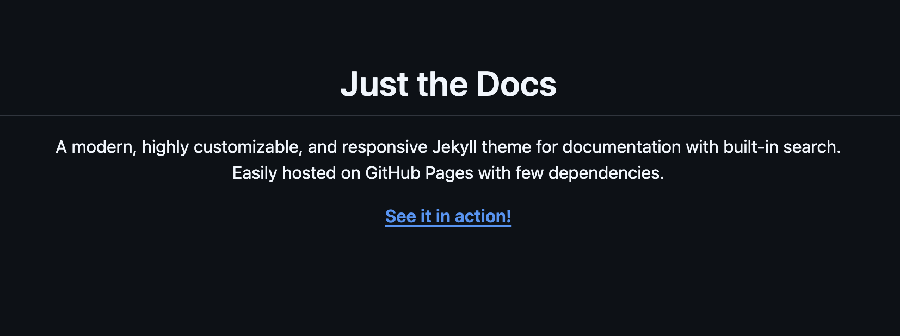

Lorem ipsum dolor sit amet consectetur adipiscing elit. Quisque faucibus ex sapien vitae pellentesque sem placerat. In id cursus mi pretium tellus duis convallis. Tempus leo eu aenean sed diam urna tempor. 


**Text 2**
Pulvinar vivamus fringilla lacus nec metus bibendum egestas. Iaculis massa nisl malesuada lacinia integer nunc posuere. Ut hendrerit semper vel class aptent taciti sociosqu. Ad litora torquent per conubia nostra inceptos himenaeos.



Для смены темы нужно использовать
```
jtd.setTheme("dark")
или
jtd.setTheme("light")
```
Можно выполнять из консоли. Т.е. достаточно просто написать свою верстку справа от меню и там добавить немного js.
А можно все одной строкой сделать
```
jtd.setTheme(jtd.getTheme() == 'dark' ? 'light' : 'dark')
```
Осталось только кнопку добавить, которая это будет делать.
```
<button onclick="jtd.setTheme(jtd.getTheme() == 'dark' ? 'light' : 'dark')">Change Theme</button>
```

